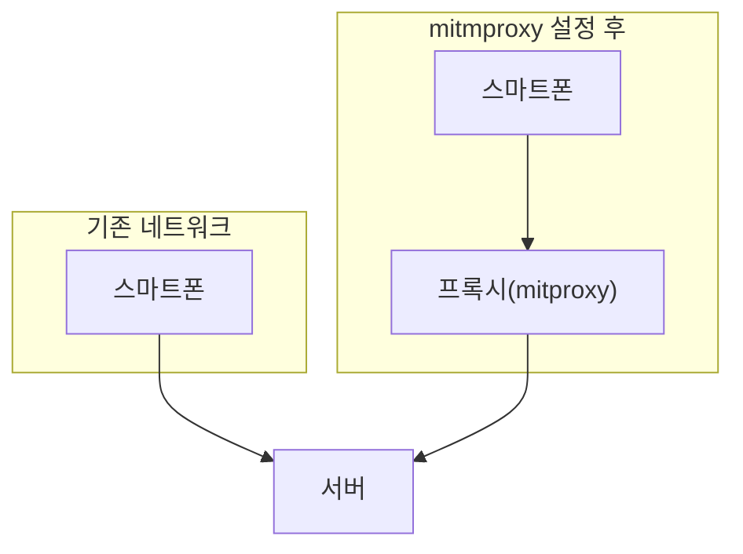

# 개요

시험기간에 도서관 토론학습실에서 공부하다가 불편한 점이 생겼다.

도서관을 출입할 때 학교 도서관 앱을 키고 **‘모바일 이용증’** 화면을 열어 QR코드를 인식해야 문이 열린다.

하지만 이 과정에서 **두 가지** 불편한 점이 있다.

1. 도서관 앱의 첫 화면 로딩시간이 오래걸린다
2. 모바일 이용증 화면까지 한 번 더 들어가야 한다

 | 
--- | ---
WIFI 환경 (약 11초 소요) | LTE 환경 (약 46초 소요)


이걸 들어가고 나갈 때마다 기다리려니, 도서관 입구도 비좁은데 거기서 사람들이 앱 기다리고 있는 것이 혼잡했고 **무엇보다 앞에서 기다리고 있는게 너무 화 났 다**.

그래서 이 QR기능을 가장 많이 사용하는 기능이라고 확신하고, QR기능을 기존 앱에서 분리할 방법을 생각했다.

# 네트워크 트래픽 뜯어보기

분명히 도서관 앱도 올바른 사용자에게만 QR생성을 해줘야 하기 때문에, 실제 학생인지 **아이디와 비밀번호** 같은 정보를 데이터베이스와 비교하는 과정이 필요하다.

따라서 서버가 존재할 것이며, 앱은 그 서버가 제공하는 **QR 생성 API**를 사용할 것이고, 그 주소를 알아내면 앱을 이용하지 않아도 내가 필요한 기능인 **QR 생성**만 빠르게 접근할 수 있을 것이다.

IOS에서 네트워크 트래픽을 감시할 수 있는 방법을 찾아봤다.

## mitmproxy
[mitmproxy로 iOS 기기의 네트워크 트래픽 살펴보기 :: Outsider's Dev Story](https://blog.outsider.ne.kr/1514)
(자세한 사용방법은 이 블로그를 참고하길 바란다)

> MITM(man in the middle)으로 네트워크를 중간에서 가로채서 볼 수 있게 해주는 도구이고 오픈소스이면서 무료로 사용할 수 있다. [How mitmproxy works](https://docs.mitmproxy.org/stable/concepts-howmitmproxyworks/)에 나와 있는 대로 폰의 모든 요청을 mitmproxy로 가게 하고 mitmproxy가 다시 이를 원래 요청한 서버로 보내주는 방식이다.
> 


- iPhone 네트워크 요청이 PC를 거쳐가게 해, PC에서 **네트워크 통신**을 확인할 수 있는 도구이다.

- 본 글은 mitmproxy의 사용방법을 다루는 글이 아니므로 자세한 설정 및 연결과정은 생략한다.
  
해당 도구 (프록시)의 **동작원리**를 간단히 설명하자면


이런식으로 스마트폰에서 서버로 전송되는 요청을 중간에서 감시하는 원리이다.

블로그를 참고해 설정을 완료했다.

## mitmproxy로 네트워크 모니터링하기
### 휴대폰 프록시 설정
우선 PC의 로컬 IP를 확인한다.
맥북에서는 터미널에서 다음과 같은 명령어로 확인할 수 있다.
```ifconfig | grep "inet " | grep -Fv 127.0.0.1 | awk '{print $2}'```


내 IP는 `192.168.219.43`이다 (빽다방에서 글 작성중)

### iPhone에서 프록시 설정
 | 
---|---

아이폰에서 [설정] - [Wi-Fi]에서 현재 사용 중인 Wi-Fi를 눌러서 들어가면 맨 아래 **HTTP 프록시**라는 부분을 볼 수 있다. 보통은 사용 안 하니 `끔`로 되어 있는데 **프록시 구성**을 눌러서 들어간다.

여기서 **수동**을 누르고 서버에서는 위에서 확인한 IP `192.168.219.43`를 입력하고 포트는 `8080`을 입력한다.

### iPhone에서 인증서 설정
과정이 복잡해 [블로그](#mitmproxy)를 참고하기 바란다.

### 연결 후 패킷 분석
설정을 마치고 터미널에 `mitmproxy`를 입력한다.

아직 스마트폰에서 아무것도 실행하지 않아 네트워크 기록이 없다.

도서관 앱을 키고 모바일 이용증 화면을 들어가봤다.


도서관 앱을 여니 여러가지 HTTP, HTTPS GET 요청 기록이 생겼다!

흠.. 앱 실행 후 전송하는 API 요청은 2가지로 보인다.

HTTPS GET
1. `lib.kangnam.ac.kr/Clicker/GetClickerClientLibraryInformation`
2. `lib.kangnam.ac.kr/Account/RequestClickerSmartCardInfomation?l_user_id=…`

QR생성에는 유저 정보가 필요할 것이니 쿼리값으로 `l_user_id`를 넘기는 **2번** API가 의심스럽다.

## API 분석

`/Account/RequestClickerSmartCardInfomation/` 의 `Request`와 `Response`를 분석해봤다.
### Request


**요청 쿼리**로 4가지, `l_user_id`, `l_user_pass`, `l_user_phone_uid`, `l_user_phone_type`  를 보낸다.

각각 아이디, 비밀번호, 휴대폰 고유번호, 휴대폰 타입(안드로이드 / iOS) 를 의심해본다.

### Response


**응답**으로 **JSON**이 오는데 `libtechAccountUseridQr` 이 수상하다.

아마 이게 QR코드를 생성하는 String 값 같다는 의심을 해본다.

## 요청 보내보기
혹시 **세션관리**나 **인증**이 따로 있는 지 확인하기 위해 이 url을 그대로 웹페이지에서 요청해봤다.


### 결과화면


자~알 된다.

이로써 결론은 누구든 QR생성하는 url만 알면 도서관 앱이 없이도 QR을 만들어서 도서관에 입장할 수 있다.

마침 아이폰에 단축어 앱으로 간단한 자동화가 가능하다는 것이 떠올라서 QR생성 요청을 보내 일회성 QR사진을 띄워주는 단축어를 만들어봤다.

# 단축어 생성 - 도서관 QR

[단축어](https://support.apple.com/ko-kr/guide/shortcuts/welcome/ios)는 iOS에서 간단한 자동화나 코드를 실행하는 묶음을 만들 수 있는 스크래치(고양이 코딩 프로그램) 같은 앱이다.

 | 
--- | ---
MacOS 단축어 화면 | iOS 단축어 화면

## 동작 원리

동작을 간단하게 기술하자면


`url` 에서 콘텐츠 요청 → `url 콘텐츠`(JSON 응답값) 에서 사전 가져오기 → 사전에서 `libtechAccountUseridQr` key에 대한 `사전 값`(value) 가져오기 → `사전 값` (value)로 QR코드 생성 → 훑어보기(1회용)으로 QR보기


이렇게 단축어를 구성했다.

QR코드 생성은 단축어 내에 이미 기능이 구현되어 있었다. (QR코드 생성은 별 거 없고 단순히 표현방식을 바꾸는 것 뿐이다)

## 실행화면
단축어는 아이폰에서 작성해서 바로 테스트해봤다.

{: width="50%" height="50%"}

약 3초정도 걸리며, 소요시간이 **72%** 단축되었다.

# 문제점 및 개선가능성?

**문제는** 이걸 나만 사용할 것이면 상관없는데 다른 사람들도 이용하게 하려면 꽤 복잡하다.

모든 사람이 
- 네트워크 패킷 감시 도구 설정 후 (mitmproxy 연결하기)
- 패킷 분석을 해서 개인별 QR생성 url을 알아낸다음
- 그걸 단축어로 작성해야 똑같이 이용가능하다는 점이다.

## 해결방법?
API요청 쿼리값들이 무슨 뜻인지 알아내면 요청을 패턴화할 수 있으므로 해결할 수 있다.

아까 [요청](#request)에서 쿼리의 key와 value들을 다시 분석해봤다.


GET 요청은 이 값들이 url 뒤에 쿼리값으로 붙어서 전송된다.

**예를들어**

https://lib.kangnam.ac.kr/Account/RequestClickerSmartCardInformation
- `l_user_id: myid`
- `l_user_pass: mypassword`
- `l_user_phone_uid: 123`
- `l_user_phone_type: iphone`

이렇게 해당 url로 위와 같은 쿼리값을 전송하면 최종적으로는

https://lib.kangnam.ac.kr/Account/RequestClickerSmartCardInformation?l_user_id=myid&l_user_pass=mypassword&l_user_phone_uid=123&l_user_phone_type=iphone

이 url로 요청을 보내는 것과 같다.

**따라서** 각각의 key가 어떤 걸 의미하는 지만 알아내면 내가 value를 사용자에 맞게 전송하면 되는데...

- `l_user_id`: 아이디(학번)
- `l_user_pass`: 비밀번호(홈페이지 비밀번호)
- `l_user_phone_uid`: 사용자 휴대폰 고유번호
- `l_user_phone_type`: 휴대폰 종류 (Android / iOS)

key의 뜻을 해석하니 이렇게 보내면 될 것 같다.

**진짜 문제는**
이 값들이 특정한 암호 알고리즘을 이용해 앱 내부에서 암호화된 후 서버로 전송된다는 것이다.

`l_user_id`의 경우 

내 학번은 `202002502` 인데 전송하는 값은 `AiZdoAGnNMyVmibRH2wrt0JL5wrt2Kw0wrt0vE2doA0AG2Vmi0HTHvEDbxxKwrtyHTJLbxzu` 이다.

어떤 원리로 암호화하는지만 알면 나도 앱을 만들어서 사용자가 입력한 아이디 비밀번호를 암호화해서 API요청만 보내면 된다.
이 알고리즘은 앱 내부의 코드로 존재해서 네트워크 분석처럼 뜯어볼 방법이 없다.

`202002502`  와 `AiZdoAGnNMyVmibRH2wrt0JL5wrt2Kw0wrt0vE2doA0AG2Vmi0HTHvEDbxxKwrtyHTJLbxzu`의 관계..

이 관계를 알아내기 위해서 나는 **암호문 단독 공격**(Ciphertext-Only Attack)을 감행하기로 했다.


> 다음 글에 이어서..
